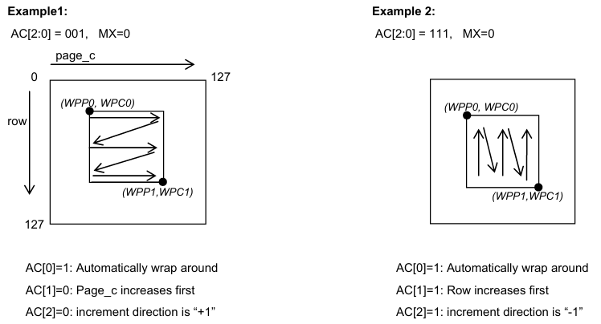
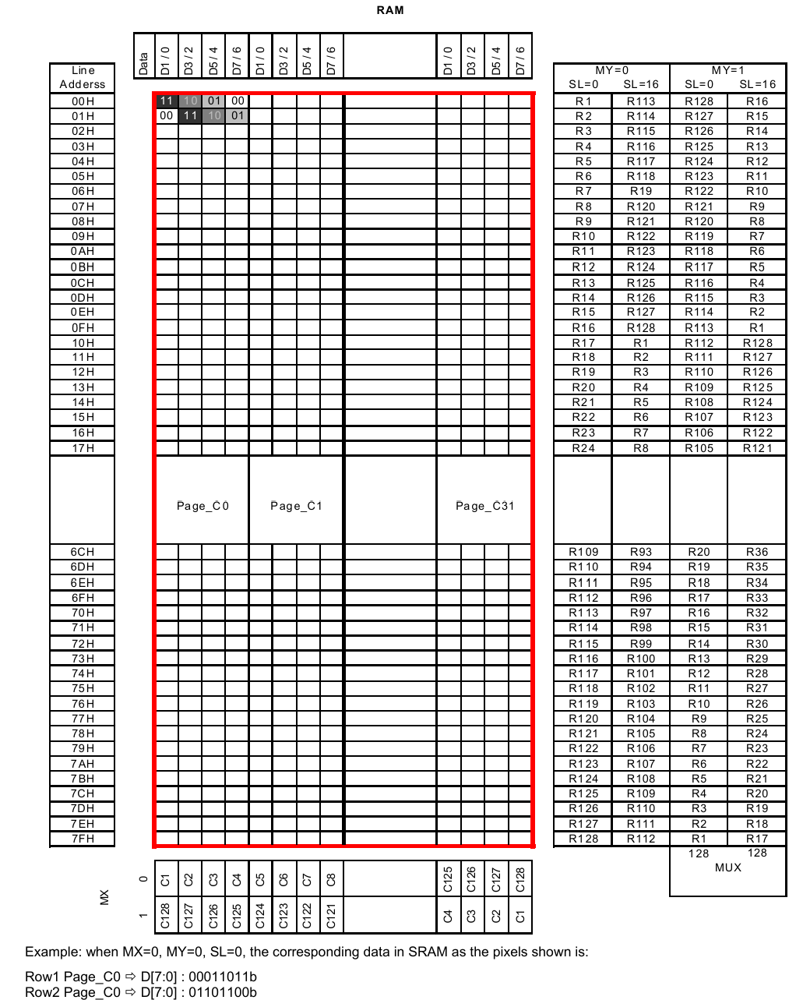

# UC1617S 四合一驱动框架

## 架构总览

```
┌─────────────────────────────────────────────────────┐
│                    用户应用层                         │
│         LCD_Init() / LCD_Flush() / LCD_DrawPixel()   │
├─────────────────────────────────────────────────────┤
│                 uc1617s_lcd.c  (LCD 驱动层)           │
│            不关心底层是什么总线, 只调函数指针           │
├─────────────────────────────────────────────────────┤
│                 uc1617s_bus.h  (传输抽象层)            │
│              uc1617s_bus_t 函数指针结构体              │
├────────┬────────┬──────────┬──────────────┤
│ 软I2C  │ 硬I2C  │  普通SPI │   DMA SPI    │
│已有代码│已有代码 │  新增     │   新增        │
└────────┴────────┴──────────┴──────────────┘
```

## 文件清单

| 文件 | 说明 |
|------|------|
| `uc1617s.h` | UC1617S 寄存器完整定义 (已有) |
| `uc1617s_bus.h` | 传输层抽象接口 (函数指针表) |
| `uc1617s_bus_i2c.c` | 软I2C + 硬I2C 传输层封装 |
| `uc1617s_bus_spi.c` | 普通SPI + DMA SPI 传输层实现 |
| `uc1617s_lcd.h` | LCD 驱动层接口 |
| `uc1617s_lcd.c` | LCD 驱动层实现 |
| `uc1617s_conf.h` | **用户配置文件** (选传输方式、屏幕尺寸) |
| `example.c` | 使用示例 |
| `sw_i2c.h/c` | 已有的软件I2C驱动 (不动) |
| `hw_i2c.c` | 已有的硬件I2C驱动 (不动) |

## 快速开始

### 1. 选择传输方式

编辑 `uc1617s_conf.h`, 取消注释你需要的方式:

```c
/* 四选一, 只能选一个 */
#define UC_USE_SOFT_I2C    /* 软件 I2C */
/* #define UC_USE_HW_I2C  */  /* 硬件 I2C */
/* #define UC_USE_SPI     */  /* 普通 SPI */
/* #define UC_USE_DMA_SPI */  /* DMA SPI */
```

### 2. 在 main.c 中初始化

```c
#include "uc1617s_lcd.h"

int main(void)
{
    /* 根据 conf.h 的宏选择对应的总线实例 */
#ifdef UC_USE_SOFT_I2C
    LCD_Init(&uc_bus_soft_i2c);
#elif defined(UC_USE_HW_I2C)
    LCD_Init(&uc_bus_hw_i2c);
#elif defined(UC_USE_SPI)
    LCD_Init(&uc_bus_spi);
#elif defined(UC_USE_DMA_SPI)
    LCD_Init(&uc_bus_dma_spi);
#endif

    LCD_Clear();
    LCD_DrawRect(10, 10, 50, 30, GRAY_BLACK);
    LCD_Flush();

    while(1) { /* ... */ }
}
```

### 3. 编译

确保以下文件加入工程:
- `uc1617s_lcd.c`
- `uc1617s_bus_i2c.c` (I2C 模式)
- `uc1617s_bus_spi.c` (SPI 模式)
- 对应的底层驱动 (`sw_i2c.c` / `hw_i2c.c`)

## SPI 接线 (UC1617S)

```
MCU              LCD
─────────────────────
PA5 (SCK)   →   SCL/SCK
PA7 (MOSI)  →   SDA/SDI
PA4         →   CS  (片选, 低有效)
PA3         →   DC  (数据/命令选择)
PA2         →   RST (硬件复位, 可选)
GND         →   GND
3.3V        →   VCC
```

**注意**: SPI 模式下, UC1617S 的 I2C 地址引脚需要按手册设置为 SPI 模式.

## 灰度值

| 值 | 宏 | 效果 |
|----|-----|------|
| 0 | `GRAY_WHITE` | 白 (最亮) |
| 1 | `GRAY_LIGHT` | 浅灰 |
| 2 | `GRAY_DARK` | 深灰 |
| 3 | `GRAY_BLACK` | 黑 (最暗) |


## DMA SPI 说明

- **命令发送**: 仍使用阻塞 SPI (数据量小, 不值得开 DMA)
- **数据发送**: 使用 DMA 传输, CPU 在传输期间可处理其他任务
- **中断**: `DMA1_Channel3_IRQHandler` 需要在 `stm32f10x_it.c` 中调用, 或由本框架直接定义
- **填充操作**: 使用 256 字节临时缓冲区分块 DMA 传输


# **显示数据 RAM**

## **数据组织**

输入的显示数据存储到双端口静态 RAM（Display Data RAM，简称 RAM）中，组织结构为 128×128×2。

设置 CA 和 RA 后，后续的数据写周期将把指定像素的数据存储到正确的存储器位置。

关于 COM、SEG、SRAM 及各存储器控制寄存器之间的关系，请参考下页的映射图。


## **显示数据 RAM 访问**

显示 RAM 是一种专用双端口 RAM，允许对其 Page_C 数据和 Row 数据进行异步访问。因此，RAM 可以独立地为主机接口和显示操作分别访问。

### **显示数据 RAM 寻址**

主机接口（HI）存储器访问操作从通过发送"设置行地址"和"设置 Page_C 地址"命令来指定行地址（RA）和 Page_C 地址（CA）开始。

如果环绕（WA，AC[0]）关闭（0），CA 到达行尾（127）后将停止递增，编程需要显式设置 RA 和 CA 的值。

如果 WA 开启（1），当 CA 到达行尾时，CA 将重置为 0，RA 将递增或递减，具体取决于行递增方向（PID，AC[2]）的设置。当 RA 到达 RAM 的边界（例 RA = 0 或 127）时，RA 将环绕到 RAM 的另一端并继续。

### **MX 实现**

Page_C 镜像（MX）通过选择 CA 或 (31−CA) 作为 RAM Page_C 地址来实现。更改 MX 会影响写入 RAM 的数据。

由于 MX 对已存储在 RAM 中的数据没有影响，更改 MX 不会对显示图案产生立即效果。要刷新显示，请在设置 MX 后刷新存储在 RAM 中的数据。

---

## **行映射**

COM 电极的扫描顺序不受起始行（SL）、固定行（FLT 和 FLB）或镜像 Y（MY，LC[2]）的影响。从视觉上看，寄存器 SL 的非零值等效于将 LCD 显示向上或向下（取决于 MY）滚动 SL 行。

### **RAM 地址生成**

通过组合固定的 COM 扫描顺序和以下 RAM 地址生成公式，可以得到存储在显示 SRAM 中的数据与扫描 COM 电极之间的映射关系。

当 FLT 和 FLB = 0 时，在显示操作期间，RAM 行地址生成可以用数学方式表示如下：

对于每场（field）的第 1 行周期：

$$Line = SL$$

其他情况：

$$Line = \text{Mod}(Line + 1,\ 128)$$

其中 Mod 是取模运算符，*Line* 是输出到 SEG 驱动器的 RAM 位切片行地址。*Line* = 0 对应 RAM 中的第一个位切片数据。

上述 *Line* 生成公式产生"循环环绕"效果，即当 *Line*+1 达到 128 时，*Line* 有效地重置为 0。通过动态更改 SL，可以模拟行滚动、行交换等效果。

**MY 实现**

行镜像（MY）通过反转 COM 电极与 RAM 之间的映射顺序来实现，即数学地址生成公式变为：

对于每场的第 1 行周期：

$$Line = \text{Mod}(SL + \text{MUX} - 1,\ 128)$$

其中 $\text{MUX} = \text{CEN} + 1$

其他情况：

$$Line = \text{Mod}(Line - 1,\ 128)$$

从视觉上看，MY 的效果等效于将显示上下翻转。存储在显示 RAM 中的数据不受 MY 的影响。


## **窗口编程**

窗口编程旨在将数据写入 SRAM 地址的指定窗口范围内。该过程应首先设置窗口边界寄存器（`WPP0`、`WPP1`、`WPC0` 和 `WPC1`），然后使能 AC[3]。设置 AC[3] 后，即可将数据写入由 (`WPP0`、`WPC0`) 和 (`WPP1`、`WPC1`) 指定的窗口地址范围内的 SRAM。若要初始化另一个窗口编程，应在修改任何窗口边界寄存器后清除 AC[3]，然后再次设置 AC[3]。

数据写入方向由 AC[2:0] 和 MX 的设置决定。当 AC[0]=1 时，数据可以在指定窗口范围内连续写入。AC[1] 控制数据是按 Page_C 方向还是按行方向写入。AC[2] 决定数据写入是从行 `WPP0` 还是 `WPP1` 开始。MX 用于确定初始 Page_C 地址，是从 `WPC0` 写到 `WPC1`，还是从 (`MC-WPC0`) 写到 (`MC-WPC1`)。



窗口编程的目的是**只往 SRAM 的一个矩形区域内写数据**，而不是整屏写入。这个矩形区域由两组寄存器定义：

| 寄存器          | 含义                                  |
| --------------- | ------------------------------------- |
| `WPP0` / `WPP1` | 窗口的行地址边界（行范围）            |
| `WPC0` / `WPC1` | 窗口的 Page_C 地址边界（列/字节范围） |

窗口的范围就是从角点 `(WPP0, WPC0)` 到角点 `(WPP1, WPC1)` 所围成的矩形。

------


## 窗口操作流程

内容中明确描述了两步：

**第一步：配置窗口**

> "该过程应首先设置窗口边界寄存器（WPP0、WPP1、WPC0 和 WPC1），然后使能 AC[3]。"

**第二步：写入数据**

> "设置 AC[3] 后，即可将数据写入由 (WPP0、WPC0) 和 (WPP1、WPC1) 指定的窗口地址范围内的 SRAM。"

**切换窗口时**：

> "若要初始化另一个窗口编程，应在修改任何窗口边界寄存器后清除 AC[3]，然后再次设置 AC[3]。"


即：改边界 → 清 AC[3] → 再设 AC[3]，才能生效新窗口。


------


## 数据写入方向（AC[2:0] + MX）

这是窗口编程的核心——数据在窗口内**怎么流动**。

内容中指出：**"数据写入方向由 AC[2:0] 和 MX 的设置决定"**，三个位各控制一个维度：

| 控制位    | 功能                                                         | 结合图片示例                                           |
| --------- | ------------------------------------------------------------ | ------------------------------------------------------ |
| **AC[0]** | 环绕开关。AC[0]=1 时，数据可以在窗口范围内**连续自动写入**（到达边界后自动换行） | 两个示例均为 AC[0]=1                                   |
| **AC[1]** | 优先方向。AC[0]=1 时此位生效：AC[1]=0 表示 **Page_C 方向优先**（先填满一行的列再换行）；AC[1]=1 表示**行方向优先**（先填满一列的行再换列） | 示例1: AC[1]=0（Page_C优先）；示例2: AC[1]=1（行优先） |
| **AC[2]** | 行起始/递增方向。决定数据从 `WPP0` 还是 `WPP1` 开始写入      | 示例1: AC[2]=0（方向+1）；示例2: AC[2]=1（方向-1）     |
| **MX**    | Page_C 起始方向。决定初始列地址是从 `WPC0` 写到 `WPC1`，还是从 `(MC-WPC0)` 写到 `(MC-WPC1)`（镜像后的地址） | 两个示例均为 MX=0                                      |

------


### 用一句话概括

**窗口编程就是：先用寄存器划定一个矩形区域，再通过 AC[3] 使能写入，然后数据按照 AC[2:0] 和 MX 指定的方向和优先级，在该矩形区域内自动流转写入。**

用图形理解两种写入顺序：

```
AC[1]=0, Page_C优先（逐行扫描）:        AC[1]=1, 行优先（逐列扫描）:

WPC0 ───────→ WPC1                     WPC0 ───────→ WPC1
WPP0 → ■ ■ ■ ■ ■                      WPP0 → ■ ■
       ↓                                ↓     ■
WPP1   ■ ■ ■ ■ ■                      WPP1   ■
                                          → ■ ■
```


箭头方向由 AC[2] 决定是 +1 还是 -1，列起始由 MX 决定。





# **RAM 结构解析**

"128×128×2" 的含义是：

| 维度 | 含义                     | 范围               |
| ---- | ------------------------ | ------------------ |
| 128  | 行数（Row，对应 COM）    | RA: 0~127          |
| 128  | 列数（SEG 像素列）       | 0~127(Page_c:0-31) |
| 2    | 每像素 2 bit（4 级灰度） | 00/01/10/11        |

每 **1 个字节** 包含 **4 个像素**（2bit × 4 = 8bit），按 Page_C 方向组织：

字节位布局

```

D7  D6  D5  D4  D3  D2  D1  D0
 │   │   │   │   │   │   │   │
 ├───┤   ├───┤   ├───┤   ├───┤
D7/6   D5/4   D3/2   D1/0
像素3   像素2   像素1   像素0

每个像素的灰度值:
  00 = 白 (最亮)
  01 = 浅灰
  10 = 深灰
  11 = 黑 (最暗)
  
  图片示例行1: 数据 = 00011011b
  D[1:0]=11 → 像素0: 黑
  D[3:2]=01 → 像素1: 浅灰
  D[5:4]=10 → 像素2: 深灰
  D[7:6]=00 → 像素3: 白

对应图片第1行模式: 11  10  01  00 → 黑 深灰 浅灰 白
          第2行: 00  11  10  01 →  白 黑 深灰 浅灰
```


内存布局

    CA=0    CA=1     CA=2         ...        CA=31
    SEG0~3  SEG4~7   SEG8~11       			 SEG124~127
    RA=0    [1字节]   [1字节]   [1字节]  ...   [1字节]     ← 32字节/行
    RA=1    [1字节]   [1字节]   [1字节]  ...   [1字节]
    RA=2    [1字节]     ...      ...    ...    ...
    ...
    RA=127  [1字节]   [1字节]   [1字节]  ...   [1字节]
    
    每行 = 32字节 = 32×4 = 128像素
    总RAM = 128行 × 32字节 = 4096 字节
    总像素 = 128行 × 128列 = 16384 像素


**MY=0, MX=0, SL=0, 窗口编程使能 — 写入一帧完整流程**

---

**前提条件**

```
初始化已完成, 寄存器状态:
  MY=0  → COM扫描正常, Row 0 → COM0 (屏幕顶部)
  MX=0  → Page_C 地址正常, CA → CA (不反转)
  SL=0  → 不滚动, 显示从 RAM Row 0 开始
  AC[0]=1 (WA)  → 自动环绕
  AC[1]=0       → CA 先递增 (水平方向优先)
  AC[2]=0       → RA 递增 +1
  WPC0=0, WPC1=31  → 页范围: 全部32页
  WPP0=0, WPP1=127 → 行范围: 全部128行
```

---

**RAM 与屏幕的映射关系 (MY=0, SL=0)**

```
RAM Row   对应 COM    屏幕位置
──────────────────────────────
Row  0    COM  0      最顶行
Row  1    COM  1      第2行
Row  2    COM  2      第3行
  ...       ...        ...
Row 95    COM 95      最底行 (第96行, 玻璃边缘)
Row 96    COM 96      玻璃外 (不可见)
  ...       ...        ...
Row 127   COM 127     玻璃外 (不可见)
```

---

**每行中像素与字节的对应关系 (MX=0)**

```
Page_C (CA):  CA=0      CA=1      CA=2    ...    CA=31
             ┌─────────┬─────────┬─────────┬───┬─────────┐
字节:         │ D[7:0]  │ D[7:0]  │ D[7:0]  │...│ D[7:0]  │
             └─────────┴─────────┴─────────┴───┴─────────┘
             ├──┤├──┤├──┤├──┤
              S3  S2  S1  S0
像素列(SEG): SEG0~3  SEG4~7  SEG8~11  ...  SEG124~127

每个字节内 (MX=0, 正向):
  D[1:0] = 最左像素 (SEG N+0)    ← 页内最左
  D[3:2] = 次左像素 (SEG N+1)
  D[5:4] = 次右像素 (SEG N+2)
  D[7:6] = 最右像素 (SEG N+3)    ← 页内最右
```

---

**写入流程**

```
步骤1: 设置起始地址
  发送: Set CA = 0   → 0x00 | 0x00 = 0x00
  发送: Set RA = 0   → 0x60 | 0x00 = 0x60

步骤2: 使能窗口编程
  发送: 0xF9         → AC[3]=1, 窗口编程使能

步骤3: 连续写入数据
  ┌──────────────────────────────────────────────────────┐
  │ 第1行 (Row 0, 显示在屏幕最顶行 COM0)                 │
  │   CA= 0 → 写1字节 → 覆盖 SEG0~3  (4个像素)           │
  │   CA= 1 → 写1字节 → 覆盖 SEG4~7                      │
  │   CA= 2 → 写1字节 → 覆盖 SEG8~11                     │
  │   ...                                                  │
  │   CA=31 → 写1字节 → 覆盖 SEG124~127                   │
  │   CA 到达边界 → 自动归0, RA +1 = 1                    │
  ├──────────────────────────────────────────────────────┤
  │ 第2行 (Row 1, 显示在 COM1)                            │
  │   CA= 0 → 写1字节 → 覆盖 SEG0~3                       │
  │   CA= 1 → 写1字节 → 覆盖 SEG4~7                       │
  │   ...                                                  │
  │   CA=31 → 写1字节 → CA归0, RA +1 = 2                  │
  ├──────────────────────────────────────────────────────┤
  │ ...                                                    │
  ├──────────────────────────────────────────────────────┤
  │ 第96行 (Row 95, 显示在屏幕最底行 COM95)               │
  │   CA= 0~31 → 写32字节                                  │
  │   CA归0, RA +1 = 96                                    │
  ├──────────────────────────────────────────────────────┤
  │ 第97~128行 (Row 96~127, 玻璃外, 不可见)               │
  │   可不写入, 或写入0x00 (全白)                          │
  └──────────────────────────────────────────────────────┘

步骤4: 禁用窗口编程 (可选)
  发送: 0xF8         → AC[3]=0
```

---

**数据写入示例**

假设屏幕第1行前4个像素要显示：黑 深灰 浅灰 白（从左到右）

```
RAM Row 0, CA=0 (SEG0~3):
  像素0(SEG0) = 黑   = 11
  像素1(SEG1) = 深灰 = 10
  像素2(SEG2) = 浅灰 = 01
  像素3(SEG3) = 白   = 00

  字节值 = D[7:6]=00 | D[5:4]=01 | D[3:2]=10 | D[1:0]=11
         = 00_01_10_11
         = 0x1B

发送: Data(0x1B)
```

---

**完整数据量统计**

```
可见区域:  96行 × 32字节 = 3072 字节 (必须写入)
不可见区域: 32行 × 32字节 = 1024 字节 (可选)
全RAM:    128行 × 32字节 = 4096 字节

每字节 = 4像素 × 2bit = 1个字节控制4个像素
每行 = 128像素 ÷ 4 = 32字节
```

---

**流程图总结**

```
设置 CA=0, RA=0
       │
       ▼
  使能窗口编程 (0xF9)
       │
       ▼
  写入数据字节 ──→ CA 自动 +1
       │                │
       │         CA 到达 31?
       │           ├── 否: 继续写下一字节
       │           └── 是: CA 归 0, RA +1
       │                    │
       │              RA 到达 127?
       │                ├── 否: 继续写下一行
       │                └── 是: RA 归 0, 全部写完
       ▼
  禁用窗口编程 (0xF8)
       │
       ▼
    完成
```


**设置寄存器**

| 序号 | 寄存器    | 命令       | 设置值 | 功能                              |
| ---- | --------- | ---------- | ------ | --------------------------------- |
| 1    | APC[2:0]  | 0x31, 0x00 | 0x00   | 厂商专用模拟性能配置              |
| 2    | TC[1:0]   | 0x24       | 00b    | 温度补偿 -0.00%/°C                |
| 3    | AC[2:0]   | 0x89       | 001b   | RAM地址控制（WA=1, CA优先, RA+1） |
| 4    | LC[6:5]   | 0xD2       | 10b    | Gray Shade 1: Level 3             |
| 5    | LC[8:7]   | 0xD7       | 11b    | Gray Shade 2: Level 6             |
| 6    | PM[7:0]   | 0x81, 0x50 | 80     | VBIAS电位器（对比度）             |
| 7    | LC[2:0]   | 0xC4       | 100b   | 映射控制（MY=1, MX=0, LC0=0）     |
| 8    | SL[6:0]   | 0x40, 0x56 | 96     | 滚动行（补偿MY=1）                |
| 9    | WPC0[4:0] | 0xF4, 0x00 | 0      | 窗口起始页                        |
| 10   | WPC1[4:0] | 0xF6, 0x1F | 31     | 窗口结束页                        |
| 11   | WPP0[6:0] | 0xF5, 0x00 | 0      | 窗口起始行                        |
| 12   | WPP1[6:0] | 0xF7, 0x7F | 127    | 窗口结束行                        |
| 13   | AC[3]     | 0xF9       | 1      | 使能窗口编程                      |
| 14   | DC[3:2]   | 0xAF       | 11b    | 开显示+灰度模式                   |


**未设置（使用默认值）的寄存器**

| 寄存器   | 默认值 | 功能                                                       | 是否需要设置   |
| -------- | ------ | ---------------------------------------------------------- | -------------- |
| BR[1:0]  | 3H     | 偏置比率，默认10b（比率=10）                               | 一般不需改     |
| PC[3:0]  | EH     | 电源控制，PC[1:0]=10（9-13nF LCD），PC[3:2]=11（内部VLCD） | 一般不需改     |
| PMO[5:0] | --     | PM偏移量                                                   | 一般不需改     |
| LC[4:3]  | 00b    | 行速率，默认14.2 Klps（灰度）                              | 一般不需改     |
| LC[10:9] | 00b    | 部分显示，默认禁用                                         | 一般不需改     |
| CEN[6:0] | 7FH    | COM扫描结束行=127                                          | 需要！见下方   |
| DST[6:0] | 00H    | 部分显示起始行                                             | 部分显示时需要 |
| DEN[6:0] | 7FH    | 部分显示结束行                                             | 部分显示时需要 |
| NIV[3:0] | 6H     | N行反转（禁用, XOR, 17行）                                 | 一般不需改     |
| FLT[3:0] | 0H     | 顶部固定行                                                 | 一般不需改     |
| FLB[3:0] | 0H     | 底部固定行                                                 | 一般不需改     |
| MTPC/MTP | 10H/-- | MTP编程                                                    | 一般不需改     |


# **电源管理命令序列示例**

以下表格展示了上电、下电和显示开/关操作的命令序列示例。这些仅用于演示一些"典型、通用"的场景。设计者应参考数据手册的相关章节，找出最适合其具体设计需求的最佳参数和控制序列。

**类型说明**

- **Required（必需）**：必须执行的项目
- **Customized（自定义）**：如果用户参数与默认值相同，则这些项目不必要
- **Advanced（高级）**：建议新手用户跳过这些命令，使用默认值
- **Optional（可选）**：这些命令取决于用户想要实现的功能

**C/D**：接口周期的类型，可以是命令（0）或数据（1）

**W/R**：数据流方向，可以是写（0）或读（1）

---

## 上电序列（POWER-UP）

| 类型 | C/D  | W/R  | D7   | D6   | D5   | D4   | D3   | D2   | D1   | D0   | 芯片动作           | 说明                         |
| ---- | ---- | ---- | ---- | ---- | ---- | ---- | ---- | ---- | ---- | ---- | ------------------ | ---------------------------- |
| R    | -    | -    | -    | -    | -    | -    | -    | -    | -    | -    | 开启 VDD 和 VDD2/3 | 等待 VDD、VDD2/3 稳定        |
| R    | -    | -    | -    | -    | -    | -    | -    | -    | -    | -    | RST 引脚置低       | RST 置低后等待 3µS           |
| R    | -    | -    | -    | -    | -    | -    | -    | -    | -    | -    | RST 引脚置高       | VDD 开启后等待 150mS         |
| R    | 0    | 0    | 0    | 0    | 1    | 1    | 0    | 0    | 0    | 1    | 自动上电复位       | VDD 开启后等待 150mS         |
| R    | 0    | 0    | 0    | 0    | 0    | 0    | 0    | 0    | 0    | 0    | 设置 APC 命令      | 开启低压检测功能             |
| C    | 0    | 0    | 0    | 0    | 1    | 0    | 0    | 1    | #    | #    | 设置温度补偿       | 设置 LCD 格式参数：MX、MY 等 |
| C    | 0    | 0    | 1    | 1    | 0    | 0    | 0    | #    | #    | #    | 设置 LCD 映射      | 微调功耗、闪烁、对比度和灰度 |
| A    | 0    | 0    | 1    | 0    | 1    | 0    | 0    | 0    | #    | #    | 设置行速率         |                              |
| C    | 0    | 0    | 1    | 1    | 0    | 1    | 0    | 1    | #    | #    | 设置灰度等级       |                              |
| C    | 0    | 0    | 1    | 1    | 1    | 0    | 1    | 0    | #    | #    | 设置偏置比率       |                              |
| R    | 0    | 0    | 1    | 0    | 0    | 0    | 0    | 0    | 0    | 1    | 设置 VBIAS 电位器  | LCD 专用工作电压设置         |
| O    | 1    | 0    | #    | #    | #    | #    | #    | #    | #    | #    | 写入显示 RAM       | 设置显示图像                 |
| R    | 1    | 0    | #    | #    | #    | #    | #    | #    | #    | #    | 设置显示使能       |                              |

---

## 下电序列（POWER-DOWN）

| 类型 | C/D  | W/R  | D7   | D6   | D5   | D4   | D3   | D2   | D1   | D0   | 芯片动作 | 说明                  |
| ---- | ---- | ---- | ---- | ---- | ---- | ---- | ---- | ---- | ---- | ---- | -------- | --------------------- |
| R    | 0    | 0    | 1    | 1    | 1    | 0    | 0    | 0    | 1    | 0    | 系统复位 |                       |
| R    | -    | -    | -    | -    | -    | -    | -    | -    | -    | -    | 泄放电容 | 关闭 VDD 前等待约 1mS |

---

## 关闭显示序列（DISPLAY-OFF）

| 类型 | C/D  | W/R  | D7   | D6   | D5   | D4   | D3   | D2   | D1   | D0   | 芯片动作     | 说明                                                         |
| ---- | ---- | ---- | ---- | ---- | ---- | ---- | ---- | ---- | ---- | ---- | ------------ | ------------------------------------------------------------ |
| R    | 0    | 0    | 1    | 0    | 1    | 0    | 1    | 1    | 1    | 0    | 设置显示禁用 |                                                              |
| C    | 1    | 0    | #    | #    | #    | #    | #    | #    | #    | #    | 写入显示 RAM | 设置显示图像（图像更新为可选操作。RAM 中的数据在睡眠状态期间会被保留。） |
| R    | 1    | 0    | #    | #    | #    | #    | #    | #    | #    | #    | 设置显示使能 |                                                              |


```C
/* ======================================================
 *  UC1617s 电源管理命令序列
 *  write_cmd(cmd)       — 单字节命令
 *  write_cmd2(cmd, dat) — 双字节命令 (命令 + 参数)
 * ====================================================== */

/* ==========================
 *  上电序列 (POWER-UP)
 * ========================== */

/* --- 1. 硬件操作 --- */
/* 开启 VDD 和 VDD2/3，等待稳定 */
/* RST 引脚拉低，等待 3µS */
/* RST 引脚拉高，等待 150mS (VDD 开启后) */

/* --- 2. Set APC (厂商推荐) --- */
write_cmd2(0x31, 0x00);

/* --- 3. Set Temperature Compensation --- */
/* 0x24 = 0010_01TC[1:0]
 * TC[1:0]: 00=-0.00%/°C  01=-0.10%/°C  10=-0.15%/°C  11=-0.05%/°C
 */
write_cmd(0x24);

/* --- 4. Set LCD Mapping Control --- */
/* 0xC0 | (MY<<2) | (MX<<1) | LC0
 * MY=1: 上下翻转   MX=0: 正常   LC0=0: 固定行不显示
 * 可选: 0xC0(正常) 0xC2(左右) 0xC4(上下) 0xC6(180°)
 */
write_cmd(0xC0);

/* --- 5. Set Line Rate --- */
/* 0xA0 | LC[4:3]
 * 00=14.2K  01=17.3K  10=21.1K  11=25.7K (灰度模式)
 */
write_cmd(0xA0);

/* --- 6. Set Gray Shade 1 --- */
/* 0xD0 | LC[6:5]
 * 00b=Level1  01b=Level2  10b=Level3  11b=Level4
 */
write_cmd(0xD2);

/* --- 7. Set Gray Shade 2 --- */
/* 0xD4 | LC[8:7]
 * 00b=Level3  01b=Level4  10b=Level5  11b=Level6
 */
write_cmd(0xD7);

/* --- 8. Set Bias Ratio --- */
/* 0xE8 | BR[1:0]
 * 00b: 比率=6   10b: 比率=10
 * 默认: 0xEB (BR=11b)
 */
write_cmd(0xEB);

/* --- 9. Set VBIAS Potentiometer --- */
/* 0x81: Set PM 命令
 * PM[7:0]: 范围 0~193, 值越大对比度越强
 * 默认: 0x4E(78), 示例: 0x50(80)
 */
write_cmd2(0x81, 0x50);

/* --- 10. Write Display RAM --- */
/* 写入显示图像数据 (96行 × 32字节 = 3072字节) */
LCD_Clear();
LCD_Refresh();

/* --- 11. Set Display Enable --- */
/* 0xAD: B/W模式+开显示 (DC[3:2]=01)
 * 0xAF: 灰度模式+开显示 (DC[3:2]=11)
 * 注意: DC[2]=1后需等待5~10mS (电荷泵浪涌)
 */
write_cmd(0xAF);
delay_ms(12);


/* ==========================
 *  关闭显示 (DISPLAY-OFF)
 * ========================== */

/* --- 1. Set Display Disable --- */
/* 0xAE: 灰度模式+关显示 (进入Sleep, 保留寄存器)
 * 0xAC: B/W模式+关显示
 */
write_cmd(0xAE);

/* --- 2. 更新显示 RAM (可选) --- */
/* RAM 数据在睡眠状态期间保留, 可选择更新图像 */
LCD_Clear();
LCD_Refresh();

/* --- 3. Set Display Enable --- */
write_cmd(0xAF);
delay_ms(12);


/* ==========================
 *  下电序列 (POWER-DOWN)
 * ========================== */

/* --- 1. System Reset --- */
/* 0xE2: 系统复位, 清除所有寄存器为默认值 */
write_cmd(0xE2);

/* --- 2. 等待泄放电容 --- */
delay_ms(1);

/* --- 3. 关闭电源 --- */
/* 关闭 VDD, VDD2/3 */

```

